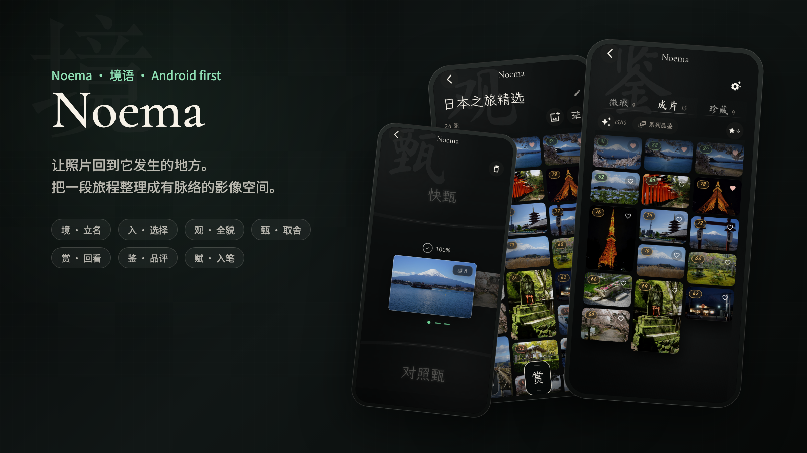
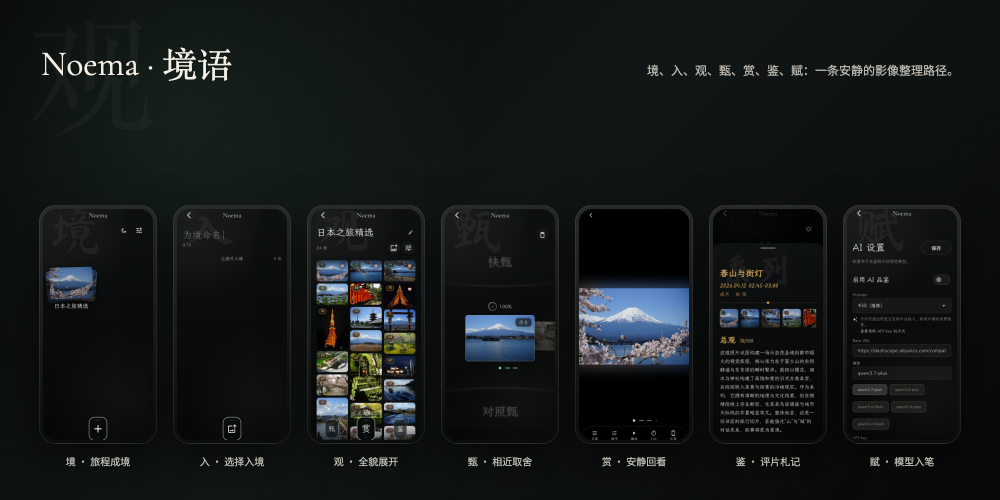
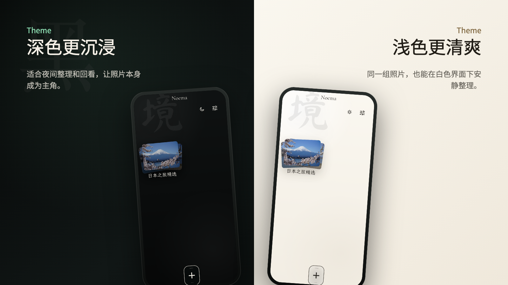
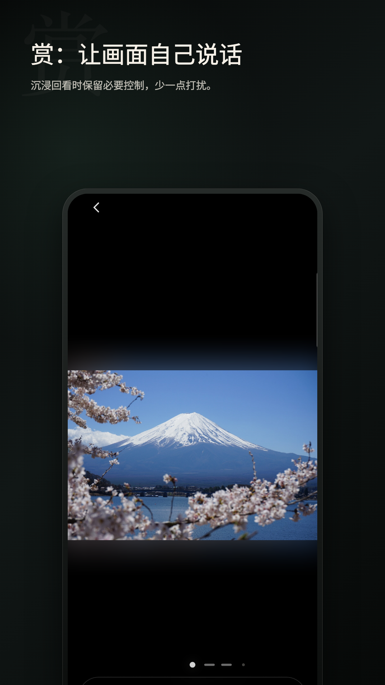
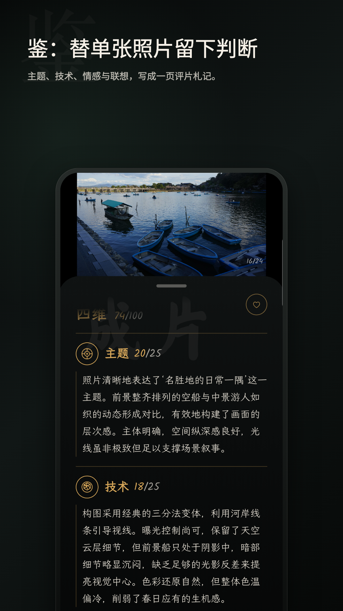
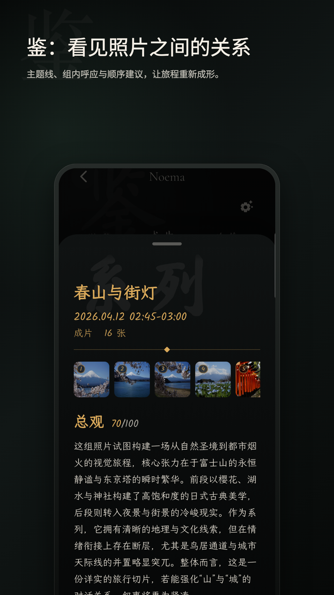
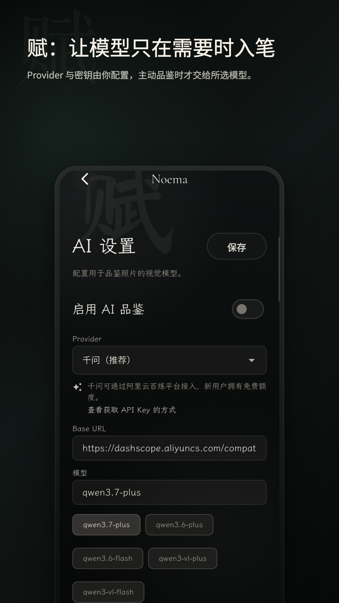

<p align="center">
  
</p>

<h1 align="center">Noema / 境语</h1>

<p align="center">
  让照片回到它发生的地方。
</p>

<p align="center">
  <a href="LICENSE"></a>
  
  
  
</p>

境语（Noema）是一处本地优先的私人影像空间，帮你把一段旅程整理成有取舍、有回看、有注解的照片脉络。

English: Give each journey a quiet order before memory turns into noise.

> 算法辅助，用户做最终审美决定。

## 快速链接

[当前状态](#当前状态) · [体验路径](#体验路径) · [产品展示](#产品展示) · [隐私与-ai](#隐私与-ai) · [下载](#下载) · [开发者](#开发者) · [贡献](#贡献)

## 当前状态

Noema 的首次公开 beta 已发布：

- 首次公开版本线：`v0.1.0-beta.1`
- Release 类型：GitHub pre-release
- 当前平台重点：Android first，iOS 保持工程支持
- 当前 release：[Noema 0.1 Beta 1](https://github.com/MrPPFruit/noema/releases/tag/v0.1.0-beta.1)
- Android package name：`com.mrppfruit.noema`
- 官方仓库：[github.com/MrPPFruit/noema](https://github.com/MrPPFruit/noema)

公开 beta 适合早期试用、问题反馈和隐私 / 构建 / 发布链路审查，不代表已经进入稳定版或 `1.0.0`。

## 体验路径

Noema 用一组单字组织照片整理路径：

| 字 | 名称 | 当前状态 | 说明 |
|---|---|---|---|
| `境` | 旅程成境 | 已实现 | 为一段旅程建立本地影像空间 |
| `入` | 选择入境 | 已实现 | 用户主动选择照片，创建或追加到当前空间 |
| `观` | 全貌展开 | 已实现 | 照片墙浏览、密度切换、多选移除和大图查看 |
| `甄` | 相近取舍 | 已实现 | 快速筛选、对照甄、相似组辅助和撤销 |
| `赏` | 安静回看 | 已实现 | 从照片墙进入的沉浸式 Viewer |
| `鉴` | 评片札记 | 首版可用 | 本机分档、珍藏、单张 / 系列 AI 品鉴和结果持久化 |
| `赋` | 模型入笔 | 首版可用 | 用户自行配置 Provider、Base URL、Model 和 API Key |

Noema 不做这些事：

- 不默认后台扫描全图库。
- 不自动删除系统相册原照片。
- 不默认上传照片到云端。
- 不提供内置 AI API Key。
- 不把公开仓库当作照片素材包或二创模板。

## 产品展示

<p align="center">
  
</p>

<p align="center">
  
</p>

| 赏 | 鉴：单张 | 鉴：系列 | 赋 |
|---|---|---|---|
|  |  |  |  |

更多发布素材：

- [GitHub cover card](docs/assets/showcase/github-cover-card.png)
- [Play feature graphic](docs/assets/showcase/play-feature-graphic.png)
- [Portrait preview video](docs/assets/showcase/noema-preview-portrait-32s.mp4)

这些展示图来自真实 App 截图或录屏帧。公开仓库不会发布原始私人照片文件。

## 隐私与 AI

Noema 的默认整理流程发生在用户设备上。只有用户主动配置 AI Provider、Base URL、Model 和 API Key，并触发 `鉴` 的 AI 品鉴时，相关照片数据才会发送到用户选择的 Provider。

| 行为 | 默认发生 | 说明 |
|---|---:|---|
| 本机导入和整理 | 是 | 用户主动选择照片后进行 |
| 后台全图库扫描 | 否 | 不在启动后默认扫描整机照片 |
| 自动删除原照片 | 否 | Noema 不替用户删除系统相册原图 |
| AI Provider 请求 | 否 | 只在用户主动配置并触发时发生 |
| 作者服务器转发 | 否 | AI 请求不经过作者服务器 |

更多细节：

- [隐私说明](PRIVACY.md)
- [隐私架构](docs/privacy-architecture.md)
- [AI Provider 与 API Key](docs/ai-provider-and-api-key.md)
- [网络请求](docs/network-requests.md)
- [发布验证](docs/release-verification.md)

## 下载

公开 APK 已发布。只建议从官方 GitHub Releases 下载：

- [Noema 0.1 Beta 1](https://github.com/MrPPFruit/noema/releases/tag/v0.1.0-beta.1)

公开 release 会提供：

- APK 文件名。
- Android package name：`com.mrppfruit.noema`。
- SHA256 校验信息。
- 版本说明和已知限制。

目前没有其他官方下载渠道。如果未来增加 Google Play、F-Droid 或其他渠道，会在 README 和 release notes 中明确说明。

## 开发者

普通试用请优先从 GitHub Releases 下载官方 APK。下面命令面向希望本地检查、构建或提交 PR 的开发者：

```bash
flutter pub get
flutter analyze
flutter test
flutter build apk --release
```

发布构建还需要 release signing。不要上传 debug APK、未签名 APK、签名密钥、keystore 或本机 `local.properties`。

版本号规则见 [docs/release-versioning.md](docs/release-versioning.md)。

## 仓库内容

这个公开仓库包含：

- Flutter App 主体源码。
- Android / iOS / Web 工程文件。
- 字体、图标和 Noema 品牌资产。
- 用户向文档、隐私说明、网络请求说明、贡献指南和安全政策。

这个公开仓库不包含：

- 私有开发仓库历史。
- 私有项目管理记录、执行日志和 agent 工具产物。
- 本地构建输出与验证日志。
- 私人旅行照片源文件或示例照片目录。
- keystore、证书、真实 API Key、token 或本机路径配置。

## 贡献

早期公开阶段优先接受 issue 和小范围 PR：

- 可复现 bug report。
- 测试用例。
- 文档修正。
- 隐私、权限、构建和发布验证问题。
- 小范围 UI 文案和可访问性改进。

大型产品方向、云同步、账号系统、追踪分析、广告 SDK、默认上传照片等改动，不适合直接提交 PR；如确有必要，请先开 issue 说明动机、隐私边界和实现影响。

请阅读 [CONTRIBUTING.md](CONTRIBUTING.md) 和 [SECURITY.md](SECURITY.md)。

## 许可与品牌

- 源码：Mozilla Public License 2.0，见 [LICENSE](LICENSE)。
- Noema / 境语名称、Logo、图标、截图、商店素材、包名和 bundle id：不随 MPL-2.0 授权，见 [TRADEMARKS.md](TRADEMARKS.md)。
- 第三方依赖、字体、图标和产品展示素材：见 [THIRD_PARTY_NOTICES.md](THIRD_PARTY_NOTICES.md)。

## 支持与反馈

当前阶段最有价值的支持是试用公开 beta、提交可复现问题、补充文档、审查隐私 / 网络边界，或验证构建与 release 包。
